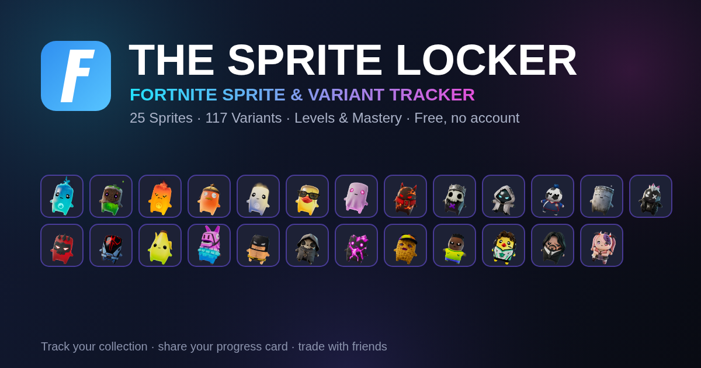

# 🗃️ The Sprite Locker

A free **Fortnite sprite & variant tracker** that runs entirely in your browser — no download, no account, no login. Track every sprite, level them up, and chase 100% Mastered. **Now updated for Chapter 7 Season 4.**

**▶ Use it here: https://qclayton15.github.io/sprite-locker/**

## Features

- **37 sprites · 153 variants** — the 12 new **Season 4** sprites (Sonic, Tails, Shadow, Jonesy, Crown, Klombo & more) plus the 25 **Legacy** (Season 3) sprites, with real in-game art
- **Season filter & badges** — switch between Season 4 (current) and Legacy, with upcoming sprites flagged **Coming soon**
- **Levels & Mastery** — level each variant from 1 → 5, then 👑 master it
- **Needs list** — see exactly which variants you're still missing or haven't mastered
- **Trade matching** — swap a code with a friend to instantly see who can trade what (no account needed)
- **View a friend's collection** — share a read-only view link, or save a list of people and switch between their collections anytime (read-only; never affects your own data)
- **Progress analytics** — completion %, breakdowns by rarity, variant and season, plus mastery-effort goals
- **Sprite Dust costs** — how much Dust it takes to re-summon a lost sprite
- **Shareable collection card** — generate an image of your progress to post or send
- **Install as an app** — add it to your phone or desktop home screen; works offline after the first visit
- **Backup code** — carry your progress between devices

## How your data works

Your progress is **private** and saved only in *your own browser* (via local storage). Nothing is uploaded and nothing is shared between users — every person who opens the link gets their own independent tracker. Moving devices? Use the **🔑 Backup** button to copy a code, then paste it into **Restore** on the other device.

## Run or host it yourself

The whole app is a single self-contained `index.html` file (all images and code are embedded), so you can open it directly or host it for free on GitHub Pages, Netlify, Cloudflare Pages, etc. To customize the sprite data or artwork, edit the `DATA` and `FILES` blocks near the top of `index.html`.

## Credits & disclaimer

This is an unofficial, fan-made tool and is **not affiliated with, endorsed by, or sponsored by Epic Games or SEGA**. "Fortnite," "Sonic the Hedgehog," and all related artwork and names are the property of their respective owners. Sprite data (Chapter 7 Seasons 3–4) is community-compiled and may need occasional corrections. Made for fans, free to use.
